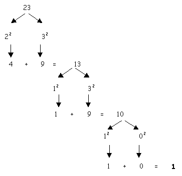

# happy-number [](https://travis-ci.org/ghpabs/happy-number)

A *happy number* is a number defined by the following process: Starting with any positive integer, replace the number by the sum of the squares of its digits, and repeat the process until the number either equals 1 (where it will stay), or it loops endlessly in a cycle which does not include 1. Those numbers for which this process **ends in 1 are happy numbers**, while those that **do not end in 1 are unhappy numbers** (or sad numbers).



## Install

```
$ npm install --save happy-number
```


## Usage

```js
const happyNumber = require('happy-number');

happyNumber(7);
//=> true

happyNumber(42);
//=> false
```


## API

### happyNumber(number)

#### number

Type: `number`


## License

MIT © [Pablo](https://github.com/ghpabs/happy-number)
